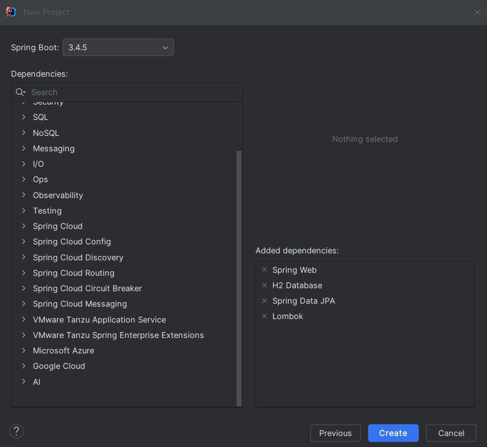

1. Créer un projet Spring Initializer avec les dépendances JPA, H2, Spring Web et Lombock

3. Créer l'entité JPA Patient ayant les attributs :
```java
@Entity
@Data @AllArgsConstructor @NoArgsConstructor  @Builder
public class Patient {
    @Id @GeneratedValue(strategy = GenerationType.IDENTITY)
    private Long id;

    @NotEmpty()
    @Size(min=4,max=40,message = "Le nom doit contenir entre 4 et 40 caractères")
    private String nom;

    @Temporal(TemporalType.DATE)
    @NotNull(message = "La date de naissance est requise")
    @DateTimeFormat(pattern="yyyy-MM-dd")
    private Date dateNaissance;

    private boolean malade;

    @DecimalMin(value="100",message = "Le score doit être supérieur ou égal à 100")
    private int score;


}
```
4. Configurer l'unité de persistance dans le ficher application.properties
```java
spring.application.name=JEE_TP2
server.port=8084
spring.datasource.url=jdbc:h2:mem:patients-db
spring.h2.console.enabled=true
```
5. Créer l'interface JPA Repository basée sur Spring data
```java 
public interface PatientRepository extends JpaRepository<Patient,Long> {
    Page<Patient> findByNomContains(String keyword, Pageable pageable);
}
```
6. Tester quelques opérations de gestion de patients :
```java
Patient patient = new Patient(null, "Imane", new Date(), false, 209);
patientRepository.save(patient);
patientRepository.save(new Patient(null, "Hanane", new Date(), false, 209));
patientRepository.save(new Patient(null, "Mohammed", new Date(), false, 209));
```
7. Migrer de H2 Database vers MySQL
```java
#spring.datasource.url=jdbc:h2:mem:patients-db
#spring.h2.console.enabled=true

spring.datasource.url=jdbc:mysql://localhost:3306/patients-db?createDatabaseIfNotExist=true
spring.datasource.username=root
spring.datasource.password=
spring.jpa.hibernate.ddl-auto=update
spring.jpa.properties.hibernate.dialect=org.hibernate.dialect.MariaDBDialect
```
8. Reprendre les exemples  du Patient, Médecin, rendez-vous, consultation, users et roles de la vidéo : 